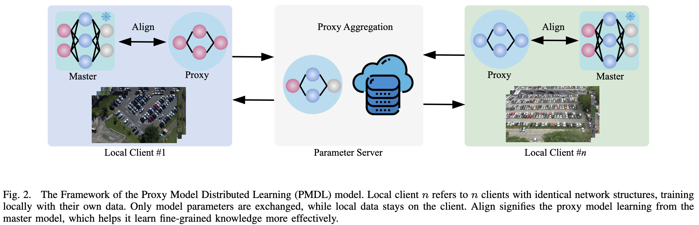
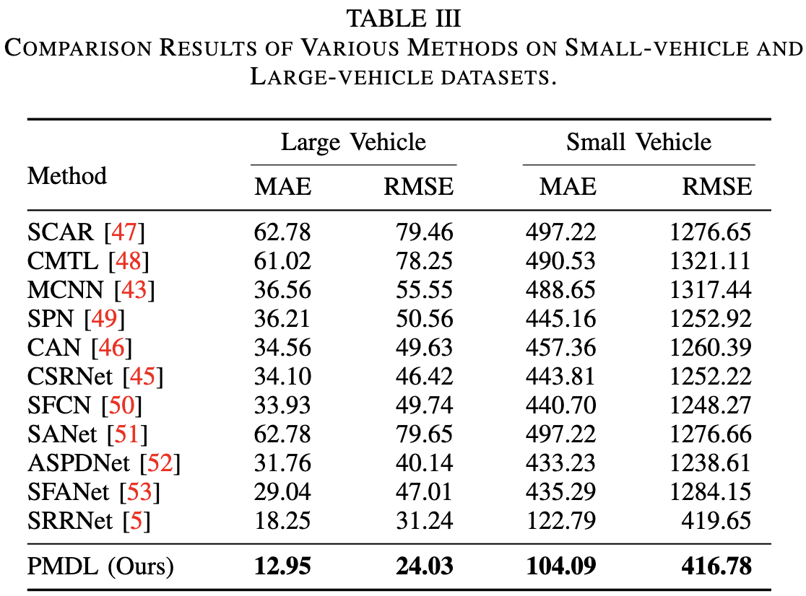
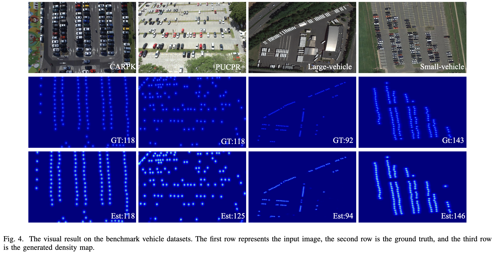

# Traffic Density Estimation by Distributed Proxy Model Learning for Internet-of-Vehicle

This repository contains the code and resources associated with our paper titled "Traffic Density Estimation by Distributed Proxy Model Learning for Internet-of-Vehicle". Please note that the paper is currently under review for publication.

The code is tested on Ubuntu 22.04 environment (Python3.10.14, PyTorch1.13.1) with an NVIDIA GeForce RTX 3090.

## Contents

- [Traffic Density Estimation by Distributed Proxy Model Learning for Internet-of-Vehicle](#traffic-density-estimation-by-distributed-proxy-model-learning-for-internet-of-vehicle)
  - [Contents](#contents)
  - [Introduction](#introduction)
  - [Results](#results)
    - [Quantitative Results](#quantitative-results)
    - [Visual Results](#visual-results)
  - [Citation](#citation)
  - [Acknowledgements](#acknowledgements)

## Introduction

The Proxy Model Distributed Learning (PMDL) model.



## Results

### Quantitative Results



### Visual Results



## Citation

If you find this code or research helpful, please consider citing our paper:

```BibTeX
@article{Li2024DPML,
title={Traffic Density Estimation by Distributed Proxy Model Learning for Internet-of-Vehicle},
author={Li, Qilei and Cheng Jing-an and Gao, Mingliang and Chen, Jinyong and Jeon, Gwanggil},
journal={under review},
year={2024},
}
```

Please note that this citation is a placeholder and will be updated with the actual citation information once the paper is accepted and published. We kindly request you to revisit this section and replace the placeholder with the correct citation detail.

## Acknowledgements

This code is built on [OSNet](https://github.com/KaiyangZhou/deep-person-reid). We thank the authors for sharing their codes.
